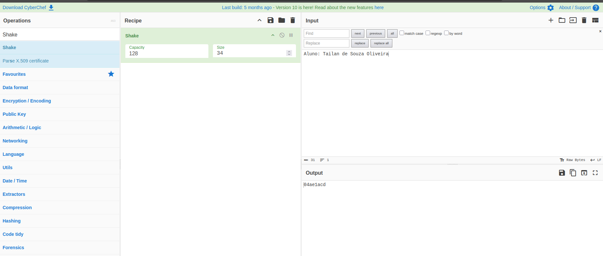
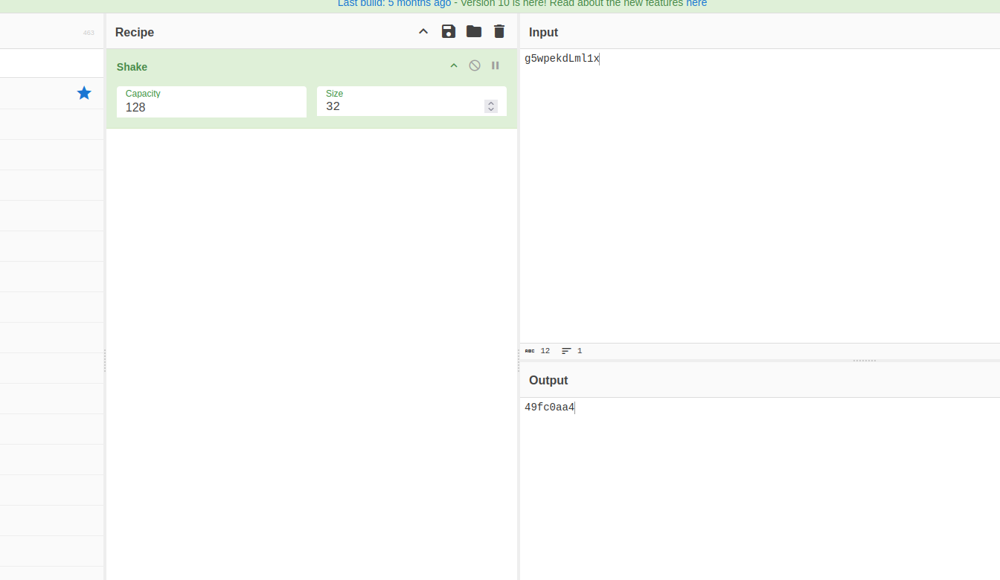
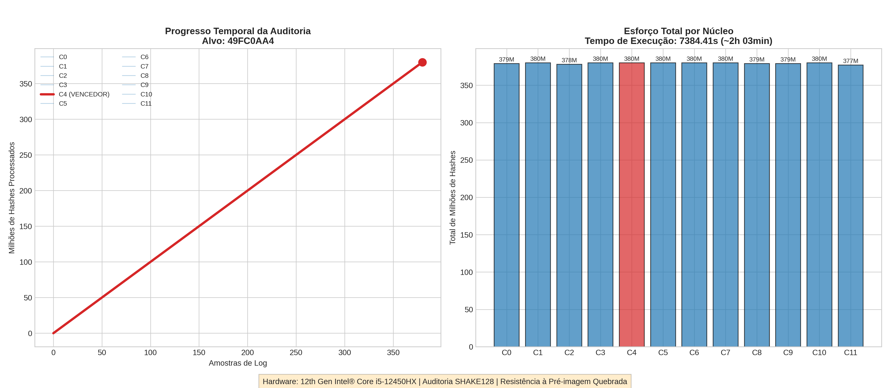

# Auditoria de Segurança: Quebra de Propriedades SHAKE128

Este projeto apresenta os resultados da auditoria de segurança sobre a função de hash **SHAKE128** (família SHA-3). O objetivo foi demonstrar a vulnerabilidade de resumos curtos frente a ataques de força bruta em hardware doméstico de alto desempenho.

## Resultados da Auditoria

Os desafios demonstraram a quebra das três propriedades fundamentais de segurança de acordo com os critérios estabelecidos:

### 1. Resistência à Colisão (Desafio A)
* **Objetivo**: Encontrar duas entradas $x$ e $y$ diferentes tais que $H(x) = H(y)$.
* **Resultado**: Sucesso em **~1 segundo**.
* **Tentativas**: 99.419.
* **Técnica**: Exploração do Paradoxo do Aniversário ($2^{n/2}$).

### 2. Segunda Pré-imagem (Desafio B)
* **Objetivo**: Dado um $x_1$ fixo, encontrar $x_2$ tal que $H(x_1) = H(x_2)$.
* **Entrada Alvo ($x_1$)**: "Aluno: Tailan de Souza Oliveira".
* **Candidato Encontrado ($x_2$)**: `pBmpOviWdgnM8q1`.
* **Hash Comum**: `04AE1ACD`.
* **Tempo Total**: **1111.16 segundos**.

### 3. Resistência à Pré-imagem (Desafio C)
* **Objetivo**: Dado apenas o hash $h$, encontrar um $x$ correspondente.
* **Hash Alvo**: `49FC0AA4` (Dificuldade de 34 bits).
* **Candidato Encontrado**: `g5wpekdLml1x`.
* **Tempo Total**: **7384.41 segundos** (~2h 03min).

---

## Esforço Computacional

O gráfico abaixo detalha o esforço total acumulado e a progressão da auditoria realizada nos 12 threads lógicos:

## 💻 Ambiente Técnico

### Hardware
* **CPU**: Intel® Core™ i5-12450HX (12 núcleos lógicos).

### Dependências (Software)
Para garantir a reprodutibilidade dos testes e da geração de gráficos, foram utilizadas as seguintes versões:
* `matplotlib==3.10.8`
* `numpy==2.4.0`
* `pandas==2.3.3`
* `pycryptodome==3.23.0`
* `pillow==12.0.0`
* `kiwisolver==1.4.9`
* *(Demais dependências listadas no repositório)*

---

## Conclusões da Auditoria
A auditoria comprovou que identificadores de 32 a 34 bits não oferecem resistência adequada contra ataques de pré-imagem e colisão em ambientes modernos. O **Desafio C** representou o maior custo computacional, exigindo a varredura de bilhões de hashes para quebrar a resistência à pré-imagem.

---
**Disciplina**: Criptografia  
**Aluno**: Tailan de Souza Oliveira  
**Data**: Dezembro de 2025
